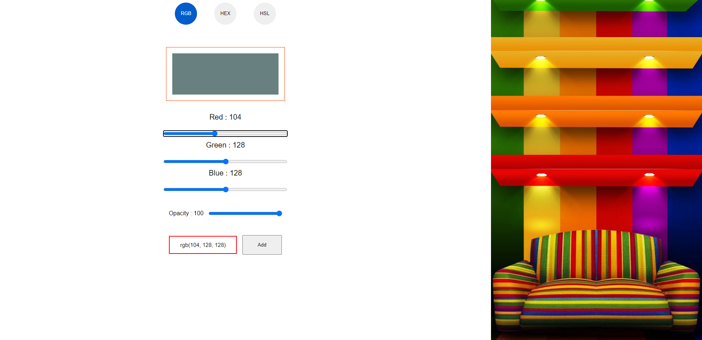

# Color Generator

This is a simple tool for choosing colors and switching between any color control of your choice.

## Technologies Used

**Tech:** HTML, CSS, JAVASCRIPT

## Features

- RGBA color control
- HSLA color control
- Responsive layout
- Cross platform

## Screenshots

## Live view

[Color Generator](https://sage-sorbet-557619.netlify.app)

